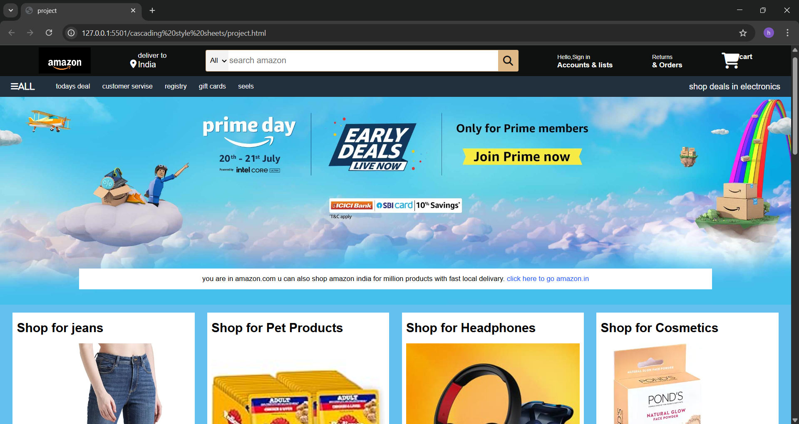

🛍️ Shopping‑Clone
A fully functional e-commerce web app replicating Amazon’s interface and core features. Built with responsive HTML and CSS.
github.com
+10
github.com
+10
github.com
+10

🚀 Overview
A front‑end clone of Amazon featuring category-wise product grids and a visually appealing layout.

Focuses purely on HTML and CSS, showcasing responsive design and static UI functionality.
github.com
+10
github.com
+10
github.com
+10
github.com

🧩 Features
Hero banner and navigation sections akin to Amazon.

Multiple product sections (e.g., electronics, fashion, home goods).

Category cards and product images with styling hover effects.

Mobile‑and‑desktop responsive layout via CSS media queries.

Clone the repo:
git clone https://github.com/Harshitha-Nuthikadi/Shopping-clone.git

Navigate to directory

cd Shopping-clone

Open index.html in your browser to view the site locally.

No build or server required — all client‑side.

🖥️ Preview
## 🖥️ Preview

📚 Tech Stack & Tools
HTML5: Structuring the complete layout.

CSS3: Styling, media queries for responsiveness, hover and transition effects.

No JavaScript frameworks, no backend — purely front‑end focused.

✅ Why This Project Stands Out
Clean and well-organized layout of product sections and navigation.

Excellent demonstration of responsive design and styling techniques.

Great portfolio addition for front‑end developers learning modern CSS.

🌟 Future Enhancements (Optional)
Add JavaScript interactivity: shopping cart, search bar, dynamic filters.

Integrate backend/database: product listings via JSON or API.

Enable user accounts or payment simulation integration.

Add accessibility improvements and ARIA tags.

👩‍💻 Credits
Created by Harshitha Nuthikadi.
Feel free to  the repo if you like it and share feedback!
